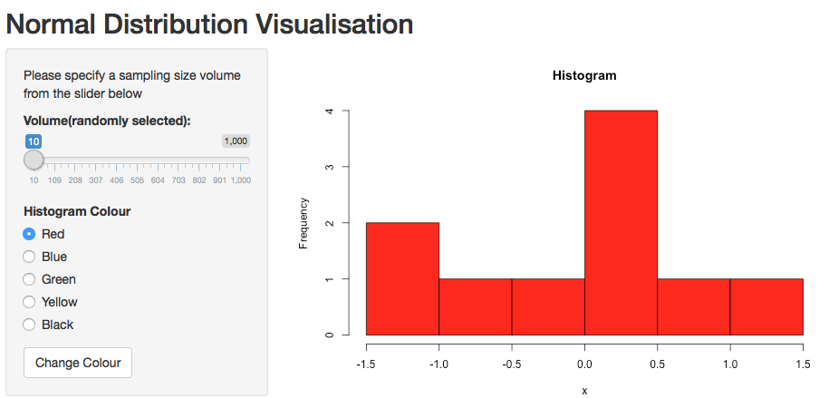
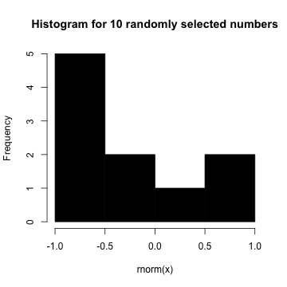
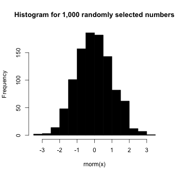

Shiny App Presentation
========================================================
author: Tugrul Ates
date: Sun Dec 27 21:21:01 2015

Shiny App to Visualize Normal Distribution
========================================================

<b>My Shniy App creates a histogram to show:</b>

- When sampling size is small, the distribution will be less like to have bell-curve form
- When the sampling size increases (>30), the distribution will have the bell-curve form
- In order to use normal distribution in our analysis or model, the sampling size should not be very small

Interface
========================================================




<b> Left handside </b>
- Volume Slider: You can choose the volume for the histogram from this slider
- Histogram Colour: You can choose the hostogram colour from these radio buttons and click 'Change Colur' button to change the histogram colour

<b> Right handside </b>
You can see the histogram that you generated from here


Normal Distribution with Low Volume
========================================================

```r
x=10
hist(rnorm(x), col = 'black', main = 'Histogram for 10 randomly selected numbers')  
```

 
<br>
The distribution does not have a perfect bell-curve shape


Normal Distribution with High Volume
========================================================

```r
x=1000
hist(rnorm(x), col = 'black', main = 'Histogram for 1,000 randomly selected numbers')  
```

 
<br>
The distribution has a perfect bell-curve shape
